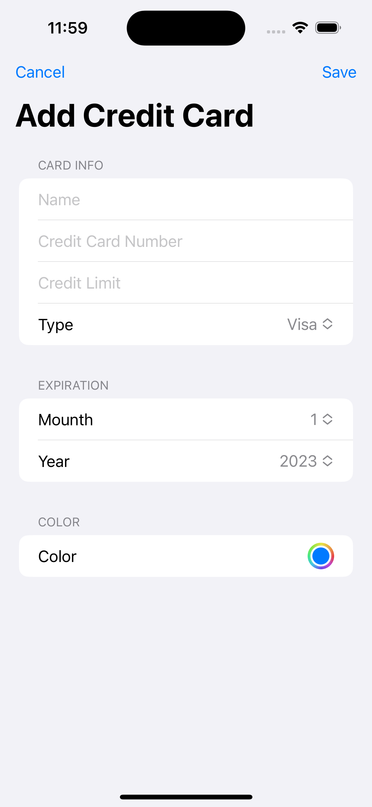

# SpendingTracking
A Sample app which enables the creation of Bank Cards, adds multiple transactions per Card and allows filtering transactions based on a transaction category. The app supports iPhone but also iPad with using size classes. 

# iPhone - Main
At the start, the main screen shows empty because there are no Credit cards saved.

# iPhone - Main - Add Card
When adding a Credit Card, the ser prefills information regarding that Card. It is possible to pick between 3 types: Visa, Mastercard and Discover, add the expiration date and also choose the card's colour. When all is set it is possible to save the card. 

  
 
 

# iPhone - Main - Added Card
When created Cards, they are shown on the main top container. Now when there is a Card, there can also be added a transaction per specific Card. Also the user is able to edit or delete the specific card by selecting the three dots on the upper right corner of the card.

 

# iPhone - Main - Add Transaction
Every Card can have transactions. While adding transactions it is possible to pick one or many categories for that specific transaction. The categories have a prefilled state but it is also possible to add new or delete a category. When the transaction is added to the main screen, the user can also perform a delete operation on a specific transaction

  
 
 

# iPhone - Main - Filtering Transactions
Users can filter transactions based on a specific category or multiple categories. If no category is selected the user should not see any transactions.

  
 

# iPad - Main - Add Card
The app also supports portrait/landscape mode for iPad. The Main screen shows a specific UI for iPad. The user has the same functionalities as on the iPhone therefore at the start he needs to add a Card.

  
  

# iPad - Main - Add Transaction
As on the iPhone, it is possible to add a transaction per Card.

  

# iPad - Main - Landscape mode 

# iPad - Main - Landscape mode - Detecting size class
in Landscape, the UI can show as compact or regular when the user uses a split screen with another app. If the UI is set as .compact size class it switches UI to be rendered as iPhone, otherwise, it shows iPad UI.

  

# Main Features:
- SwiftUI for building UI
- Core Data, 
  - CRUD
  - Relations: 
    - one to many, transactions per card
    - many to many, categories on transactions 
- Usage pf size class for iPad UI
